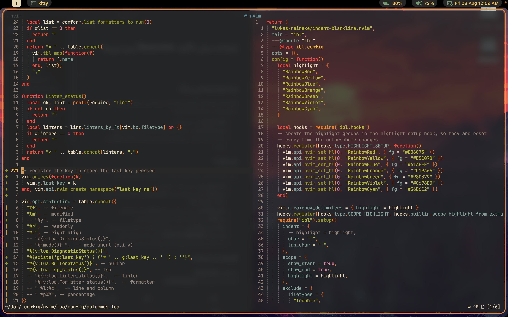

## ليه أضبط إعداداتي يدويًّا؟

تقدر تركّب توزيعة جاهزة وتوفّر على نفسك وقت، بس كذا بتصير معتمد على مصدر خارجي يحدّث أو يختفي فجأة. لما تضبط إعداداتك بنفسك:

- **تقلّل الاعتماديّة** على مشاريع غيرك.
- **تصير فاهم كل ملف** وش يسوي، فتقدر تحل المشاكل وتحدّث الإضافات بسهولة.
- ركّزنا هنا على الاستغناء عن إضافات ثقيلة مثل شريط الحالة _status-line_ قدر الإمكان.

## وش المزايا؟

حرصت تكون الإعدادات متكاملة مع أدوات كثيرة، وتوفّر تجربة استخدام حديثة :

- **إكمال تلقائي ذكي** (مدعوم بالذكاء الاصطناعي).
- **تنسيق أكواد** تلقائي يدعم لغات مثل JS, TS, Go, Astro, Markdown, CSS, Bash, Rust.
- **تكامل Git كامل**: تسحب وتدفع وتسوّي rebase وأنت داخل المحرّر.
- **دعم LSP** فوري لاكتشاف الأخطاء واقتراح الحلول لعدّة لغات.
- **واجهة عصرية وشكل أنيق**: ثيمات متنوّعة وطريقة عرض مرتّبة للرسائل والتنبيهات.
- **الوان النصوص والاكواد (Syntax Highlight)** بألوان جميلة تدعم لغات كثيرة.
- وغير ذلك من الميزات اللي تخلي التعامل مع الأكواد والنصوص أسهل وأمتع.

## الإضافات المستخدمة

**مدير الحزم:** `lazy.nvim`  
كل الإضافات موجودة تحت `lua/plugins/`

| الفئة            | الملف                                        | الوصف المختصر                             |
| ---------------- | -------------------------------------------- | ----------------------------------------- |
| الذكاء الاصطناعي | `ai.lua`                                     | مساعد كتابة ذكي                           |
| الإكمال التلقائي | `blink.lua`                                  | بديل خفيف لـ nvim-cmp                     |
| تنسيق الأكواد    | `conform.lua`                                | Formatter متعدد اللغات                    |
| إدارة Git        | `Git.lua`                                    | أوامر Git داخل Neovim                     |
| LSP              | `core/lsp.lua`                               | إعداد الخوادم والـ capabilities           |
| الواجهة          | `noice.lua`, `miniFiles.lua`, `whichKey.lua` | رسائل محسّنة، متصفح ملفات، تلميحات مفاتيح |
| تمييز الصيغة     | `treesittr.lua`                              | مبني على Tree-sitter                      |
| الثيمات          | `theme.lua`                                  | ثيمات جاهزة للتبديل                       |

... وغيرهم كثير.

## طريقة التثبيت

```bash
# 1. انسخ المستودع إلى المسار ~/.config/nvim
git clone https://github.com/x0d7x/dot/tree/master/.config/nvim ~/.config/nvim

# 2. شغّل Neovim لأول مرة

# lazy.nvim بيحمّل كل الإضافات تلقائيًا
```

## اختصارات لوحة المفاتيح

جميع الاختصارات موجودة في `lua/config/keymaps.lua`.  
افتح الملف وتصفّحه عشان تعرف أسرع الطرق للتعديل على الإعدادات.

## التخصيص

انت حر بالتعديل على الإعدادات بما يناسبك. أهم الملفات:

- **`init.lua`**: ملف البداية للمحرر.

- **`lua/config/opts.lua`**: إعدادات Neovim العامة.

- **`lua/plugins/`**: أضف أو احذف الإضافات.

- **`lua/core/`**: ملفات الأساس للمحرّر.
